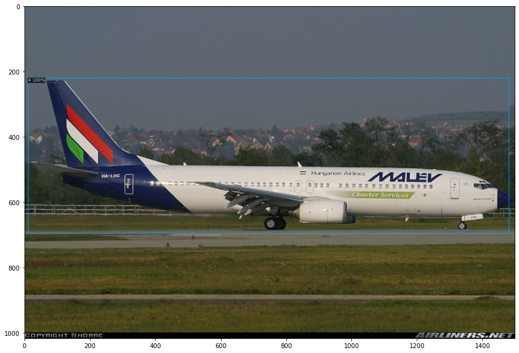
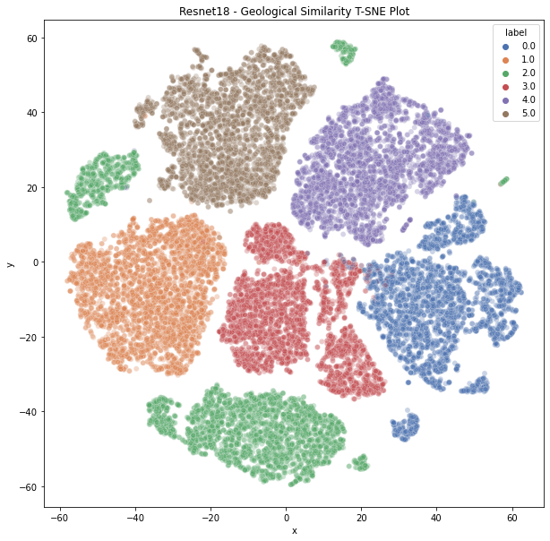
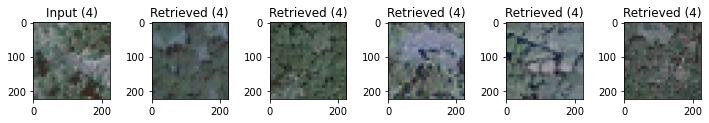

# Zack Steck - Work Sample

This repository contains code for 3 work samples. 2 of the work samples are listed as "complete", with emphasis on 
the parenthesis. As there are many more possibilities to explore (Focal loss, WEFT classifiers, self-supervised learning, etc.), 
I don't consider them to be truly complete. However, Please consider my submissions in the following order 
(in both time and GPU cycles spent):

1. [Manufacturer Identification - "Complete"](#manufacturer-identification-complete---at-a-glance)
2. [Geological Similarity - "Complete"](#geological-similarity-complete---at-a-glance)

All experimentation was done in the form of Jupyter notebooks for easy web-based rendering 
(you can view it in this repository). There are some supporting scripts to create datasets for the detection task.

I acknowledge that I didn't have to do two work samples, but I really enjoy working on these types of challenges and would
really have attempted them all given more time. 
___
# Installation

## Anaconda

The `environment.yml` in the root of this directory can be used to create an anaconda environment. To setup this 
repository using anaconda, run the following command from the root of the repository:

```
conda env create -f environment.yml
```

## Docker

### 1. Build the container
The `docker` folder in the root of this repository contains a bash script that will build a docker container with all necessary dependencies required 
to run this repository. To build the docker container, from the root of this repository, run:

```
cd docker
./build_docker.sh
```

The build will take some time as Detectron2 requires Pycocotools, which leans on gcc (so I couldn't use a pre-built pytorch container, sadly).

### 2. Run the container

The above commands will create a docker image called `zsteck:1.0.0`. To run the container, run the `run_container.sh` bash script. 
If you wish to run the notebooks on your data, then please run the following command, taking care to mount your data directory:

```
docker run --rm -it --ipc=host -p 9000:9000 -v /path/to/data/on/host:/home/appuser/data zsteck:1.0.0
```

______

# Manufacturer Identification ("Complete") - At a Glance

|  | 
|:-------------------------------------------------------:| 
|   *Predicted bounding box from my Detectron2 model.*    |


### How to train/evaluate

#### 1. Run the cvt2coco.py script.

In order to work with the data a bit easier, I created a script that converts the downloaded files into COCO formatted 
datasets. This script needs to be executed 3 times for train, val, and test. See the help output below: 

```
usage: cvt2coco.py [-h] [--box_coords BOX_COORDS] [--box_labels BOX_LABELS] [--image_root IMAGE_ROOT] [--labels LABELS] [--output OUTPUT]

This script support converting voc format xmls to coco format json

optional arguments:
  -h, --help            show this help message and exit
  --box_coords BOX_COORDS
                        Path to txt file containing img_name, box_coords in (min_x, min_y, max_x, max_y)
  --box_labels BOX_LABELS
                        Path to split entry containing image_name, target_label tuples
  --image_root IMAGE_ROOT
                        Path to image root directory.
  --labels LABELS       Path to label list
  --output OUTPUT       path to output json file
```

An example of the command I used to run it is

```
python cvt2coco.py
   --box_coords /home/zack/datasets/manufacturer_identification/data/images_box_VOC_coords.txt \
   --box_labels /home/zack/datasets/manufacturer_identification/data/images_manufacturer_train.txt \
   --image_root /home/zack/datasets/manufacturer_identification/data/images \
   --labels /home/zack/datasets/manufacturer_identification/data/manufacturers.txt \
   --output /home/zack/datasets/manufacturer_identification/data/coco/train.json
```

#### 1. Visualize the new datasets you created

To verify the data is valid, you can visualize the results using the `visualizer.py` script. The help output is below:

```
usage: visualize.py [-h] [--image_root FILE] [--annotations_json FILE]

Visualize ground-truth data

optional arguments:
  -h, --help            show this help message and exit
  --image_root FILE     path to config file
  --annotations_json FILE
                        path to config file
```

An example of the command I used to run it is:

```
python visualize.py --image_root /home/zack/datasets/manufacturer_identification/data/images \
   --annotations_json /home/zack/datasets/manufacturer_identification/data/coco/train.json
```

#### 2. Launch the the jupyter notebooks

Either launch the jupyter notebooks from the anaconda environment or run the docker dontainer using the commands 
described in the Installation section. 

### Experiments

#### Baseline Experiment
* Data: Converted to COCO
* Model: Resnet50 Faster-RCNN FPN, COCO Pretrained weights

|   AP   |  AP50  |  AP75  |  APs  |  APm  |  APl   |
|:------:|:------:|:------:|:-----:|:-----:|:------:|
| 91.412 | 96.600 | 95.829 |  nan  |  nan  | 91.412 |

| category                 | AP     | category             | AP     | category             | AP     |
|:-------------------------|:-------|:---------------------|:-------|:---------------------|:-------|
| ATR                      | 96.341 | Airbus               | 93.161 | Antonov              | 94.794 |
| Beechcraft               | 92.867 | Boeing               | 94.067 | Bombardier Aerospace | 92.853 |
| British Aerospace        | 90.460 | Canadair             | 93.872 | Cessna               | 89.677 |
| Cirrus Aircraft          | 89.984 | Dassault Aviation    | 95.668 | Dornier              | 91.257 |
| Douglas Aircraft Company | 82.414 | Embraer              | 95.371 | Eurofighter          | 93.373 |
| Fairchild                | 92.097 | Fokker               | 93.718 | Gulfstream Aerospace | 91.910 |
| Ilyushin                 | 91.306 | Lockheed Corporation | 84.836 | Lockheed Martin      | 94.088 |
| McDonnell Douglas        | 87.587 | Panavia              | 94.274 | Piper                | 86.103 |
| Robin                    | 90.450 | Saab                 | 96.454 | Supermarine          | 77.434 |
| Tupolev                  | 94.180 | Yakovlev             | 92.042 | de Havilland         | 89.724 |

#### Class Balanced Experiment
* Data: Converted to COCO, Custom WeightedRandomSampler
* Model: Resnet50 Faster-RCNN FPN, COCO Pretrained weights

|   AP   |  AP50  |  AP75  |  APs  |  APm  |  APl   |
|:------:|:------:|:------:|:-----:|:-----:|:------:|
| 89.569 | 95.452 | 94.815 |  nan  | 0.000 | 89.585 |

| category                 | AP     | category             | AP     | category             | AP     |
|:-------------------------|:-------|:---------------------|:-------|:---------------------|:-------|
| ATR                      | 94.710 | Airbus               | 92.614 | Antonov              | 92.915 |
| Beechcraft               | 94.096 | Boeing               | 92.298 | Bombardier Aerospace | 86.161 |
| British Aerospace        | 91.019 | Canadair             | 95.635 | Cessna               | 88.317 |
| Cirrus Aircraft          | 90.179 | Dassault Aviation    | 92.970 | Dornier              | 94.756 |
| Douglas Aircraft Company | 77.446 | Embraer              | 92.380 | Eurofighter          | 81.951 |
| Fairchild                | 90.522 | Fokker               | 88.231 | Gulfstream Aerospace | 91.321 |
| Ilyushin                 | 79.919 | Lockheed Corporation | 83.153 | Lockheed Martin      | 95.023 |
| McDonnell Douglas        | 86.652 | Panavia              | 94.099 | Piper                | 83.636 |
| Robin                    | 84.955 | Saab                 | 94.010 | Supermarine          | 81.291 |
| Tupolev                  | 97.046 | Yakovlev             | 92.281 | de Havilland         | 87.500 |

### Future Directions

Some obvious directions include obtaining more data to train on from publicly available datasets. Other more exotic 
things to try include:
1. Train for longer. There is likely some more performance we can squeeze out of the baseline, but there are likely significant
performance gains we can pull from the class balanced approach if we simply trained for longer. However, time and resources are
limited.
2. Leveraging a smarter loss function. Something like Reduced Focal Loss, which won the xView competition back in 2018
   (a notoriously long-tailed dataset), could help to overcome the class imbalance even better. That being said, this 
   would be more complex to implement as it would require modifying the Faster-RCNN FPN and Class head loss functions.
3. Performing downstream classifier fusion. It would be interesting to take the detected bounding boxes/labels and 
   construct a fusion approach (using logistic regression or something simple) that would ingest the output of WEFT 
   classifiers to help boost performance. The WEFT (Wings Engine Fuselage and Tail) classifiers would be downstream recognition
models that would attempt to ingest the detected object chip and classify sum attributes about the aircraft (e.g. number of engines, 
wingspan, engine type, etc.).

# Geological Similarity ("Complete") - At a Glance

|  |
|:---------------------------------------------------------------------:| 
|               *TSNE Produced by my supervised Resnet18*               |

|  |
|:------------------------------------------------------------------------------:| 
|              *Input Image and Top 5 Nearest Neighbor Retrievals*               |

### How to run

#### 1. Run the "Generate Train, Val, Test" notebook

This notebook will generate a train/val split for us to work with in our experiment. This will create a train and val directory
containing symlinks to the data splits.

#### 2. Run the "supervised_baseline" notebook

This notebook performs model training and produces the graphics you see above.

### Experiment

* Data: 80/20 split (for simplicity)
* Model: Resnet18 (small, fast, but still robust)
* Validation Results: 99.1345% accuracy
* kNN on validation results (without model selection)
   * Acc@1 = 98.9667%
   * Acc@5 = 99.3667%

### Future Directions

1. I would really like to construct a more robust feature extractor for this, particularly through the use of 
self-supervised training. Noise Contrastive Estimation approaches like UFL and Mocov1/2/3, while computationally expensive,
are really easy to drop in any backbone and train to performance. They have proven that self-supervised pretraining
leads to more robust features and often more separable feature spaces. Of course, I could get fancier and try newer approaches
like SWAV/BYOL, DINO or MAE, but those models are complex. If I had an additional day, I would absolutely throw a self-supervised
training regime at this to see how that effected the embedding space. That being said, performance is already really saturated
so I doubt there'd be a quantifiable difference in performance.
